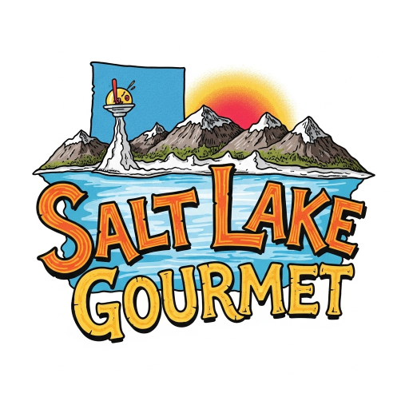

# 🍽️ Salt Lake Gourmet - Premium Recipe Website

A modern, professional gourmet recipe website celebrating Salt Lake City's culinary scene. Built with Next.js 14, TypeScript, and Tailwind CSS, featuring Utah-specific recipes and stunning visual design.



## ✨ Features

### 🎨 **Modern Design**
- **Stunning Visual Design** with glassmorphism effects and modern gradients
- **Responsive Layout** optimized for all devices
- **Interactive Animations** including hover effects and micro-interactions
- **Professional Typography** with Inter font family
- **Enhanced Logo Integration** throughout the site

### 🍽️ **Recipe Management**
- **12 Featured Recipes** showcasing Salt Lake City cuisine
- **Utah Specialty Highlighting** with local cultural connections
- **Difficulty Levels** (Easy, Medium, Hard) with visual indicators
- **Comprehensive Recipe Details** including prep time, servings, calories
- **Tag System** for easy categorization and discovery

### 🏔️ **Salt Lake City Focus**
- **Local Inspiration** from Utah landmarks (Temple Square, Antelope Island, Park City)
- **Regional Ingredients** featuring Utah honey, mountain herbs, local produce
- **Cultural Authenticity** with elevated takes on Utah classics (fry sauce, funeral potatoes, scones)
- **Geographic SEO** optimized for Salt Lake City searches

### 🚀 **Technical Excellence**
- **Next.js 14** with App Router architecture
- **TypeScript** for type safety and better development experience
- **Tailwind CSS** with custom utilities and animations
- **Performance Optimized** with static generation and image optimization
- **SEO Enhanced** with proper meta tags and structured data ready

## 🏆 Featured Recipes

### Utah Specialties
- **Gourmet Utah Fry Sauce Burger** with Mountain Herbs
- **Elevated Utah Scones** with Honey Butter
- **Gourmet Funeral Potatoes** with Truffle Oil

### Local Inspirations
- **Cottonwood Canyon Pan-Seared Trout**
- **Salt Lake Brewery Bratwurst** with Beer-Caramelized Onions  
- **Temple Square Herb-Crusted Lamb**
- **Antelope Island Bison Chili**
- **Zion National Park Inspired Flatbread**

### Gourmet Favorites
- **Wasatch Mountain Honey-Glazed Salmon**
- **Great Salt Lake Inspired Seafood Risotto**
- **Liberty Park Picnic Pasta Salad**
- **Park City Mountain Apple Crisp**

## 🛠️ Tech Stack

- **Framework**: Next.js 14 with App Router
- **Language**: TypeScript
- **Styling**: Tailwind CSS with custom utilities
- **Fonts**: Inter (Google Fonts) + Geist (local)
- **Images**: Next.js Image optimization
- **Development**: ESLint configuration

## 🚀 Getting Started

### Prerequisites
- Node.js 18+ 
- npm or yarn

### Installation

1. **Clone the repository**
```bash
git clone https://github.com/ryanmerrillmba/Salt_Lake_Gourmet.git
cd Salt_Lake_Gourmet
```

2. **Install dependencies**
```bash
npm install
```

3. **Start development server**
```bash
npm run dev
```

4. **Open in browser**
Navigate to `http://localhost:3000`

### Build for Production

```bash
npm run build
npm start
```

## 📁 Project Structure

```
Salt_Lake_Gourmet/
├── app/                          # Next.js App Router
│   ├── [lang]/                   # Internationalized routes
│   │   ├── page.tsx             # Homepage
│   │   ├── layout.tsx           # Language-specific layout
│   │   ├── about/               # About page
│   │   ├── recipes/             # All recipes listing
│   │   └── recipe/[id]/         # Individual recipe pages
│   ├── globals.css              # Global styles + Tailwind
│   ├── layout.tsx               # Root layout with SEO
│   └── page.tsx                 # Root redirect to /en
├── components/                   # React components
│   ├── Navigation.tsx           # Enhanced navigation with logo
│   ├── HeroSection.tsx          # Modern hero with animations
│   ├── RecipeCard.tsx           # Enhanced recipe cards
│   └── Footer.tsx               # Modern footer design
├── lib/                         # Utilities
│   ├── dictionaries.ts          # i18n content
│   └── types.ts                 # TypeScript definitions
├── data/                        # Data layer
│   └── recipes.ts               # Recipe database (12 recipes)
└── public/
    └── images/                  # Recipe and logo images
```

## 🎨 Design Features

### Visual Enhancements
- **Glassmorphism Effects** with backdrop blur
- **Modern Gradients** and color schemes
- **Smooth Animations** using CSS transforms
- **Interactive Hover States** throughout the interface
- **Enhanced Typography** with proper hierarchy

### Recipe Cards
- **Enhanced Hover Effects** with scale and shadow animations
- **Gradient Badges** for Utah specialties and featured recipes
- **Improved Information Display** with better visual hierarchy
- **Modern Color Coding** for difficulty levels

### Navigation & Layout
- **Logo Integration** in header and footer
- **Animated Navigation** with underline hover effects
- **Responsive Mobile Menu** with improved styling
- **Enhanced Footer** with gradient background and social icons

## 🏔️ Salt Lake City Authenticity

Each recipe connects authentically to Salt Lake City and Utah:

- **Cottonwood Canyon Trout** → Local fishing culture
- **Temple Square Lamb** → Fine dining scene  
- **Antelope Island Bison Chili** → Utah wildlife
- **Park City Apple Crisp** → Mountain seasonal produce
- **Liberty Park Pasta Salad** → Outdoor lifestyle
- **Salt Lake Brewery Bratwurst** → Craft beer scene

## 📈 SEO & Performance

- **Location-Based SEO** for Salt Lake City
- **Structured Data** ready for implementation
- **Performance Optimized** with Next.js features
- **Mobile-First** responsive design
- **Fast Loading** with static generation

## 🤝 Contributing

1. Fork the repository
2. Create a feature branch (`git checkout -b feature/amazing-feature`)
3. Commit your changes (`git commit -m 'Add amazing feature'`)
4. Push to the branch (`git push origin feature/amazing-feature`)
5. Open a Pull Request

## 📝 License

This project is licensed under the MIT License - see the [LICENSE](LICENSE) file for details.

## 🙏 Acknowledgments

- Inspired by Salt Lake City's vibrant food scene
- Utah's natural beauty and local ingredients
- Modern web design principles and best practices

## 📞 Contact

For questions about this project, please open an issue on GitHub.

---

**Built with ❤️ for Salt Lake City food enthusiasts**

*Elevating Utah's culinary scene through modern web design*
